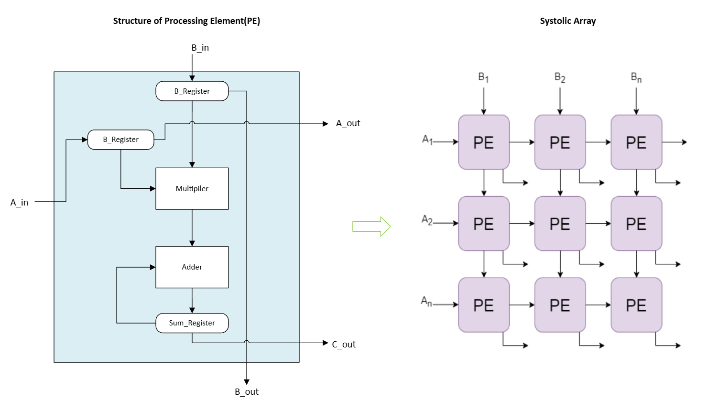

# 3×3 Systolic Array Matrix Multiplication (SystemC)

A simple **SystemC implementation of a 3×3 systolic array** used to perform **matrix multiplication**.
This project demonstrates how **Processing Elements (PEs)** communicate in a systolic architecture and how data is scheduled using **skewed inputs and pipeline flushing**.

The design models the fundamental architecture used in **hardware accelerators for deep learning and matrix computation**.

---

# Overview

A **systolic array** is a network of processing elements that rhythmically compute and pass data through the system.

In this project:

* Matrix **A values flow horizontally (left → right)**
* Matrix **B values flow vertically (top → bottom)**
* Each **Processing Element (PE)** performs a **Multiply-Accumulate (MAC)** operation

The array computes:

```
C = A × B
```

---

# Architecture


Each PE computes:

```
sum += Aik × Bkj
```

---

# Processing Element (PE)

Each PE contains:

* multiplier
* adder
* accumulator
* forwarding registers

# Project Structure

```
systolic-array-systemc/
│
├── pe.h
│   Processing Element implementation
│
├── systolic_array.h
│   3×3 systolic array architecture
│
├── main.cpp
│   Testbench and matrix input scheduling
│
└── README.md
```

---

# Requirements

* C++ compiler (GCC / Clang)
* SystemC library

Install SystemC from:

https://www.accellera.org/downloads/standards/systemc

---

# Compilation

Example compilation command:

```
g++ main.cpp -I$SYSTEMC_HOME/include -L$SYSTEMC_HOME/lib-linux64 -lsystemc -o systolic_array
```

Run:

```
./systolic_array
```

---

# Example Matrices

Matrix A:

```
1 2 3
4 5 6
7 8 9
```

Matrix B (Identity):

```
1 0 0
0 1 0
0 0 1
```

---

# Expected Output

```
Result Matrix C:
1 2 3
4 5 6
7 8 9
```

---

# Key Implementation Details

### 1. Skewed Input Scheduling

Rows of matrix **A** and columns of matrix **B** are delayed so that the correct operands arrive at each PE at the same clock cycle.

Example timing:

| Cycle | A inputs    | B inputs    |
| ----- | ----------- | ----------- |
| 0     | A00         | B00         |
| 1     | A01 A10     | B10 B01     |
| 2     | A02 A11 A20 | B20 B11 B02 |

---

### 2. Reset Control

Each Processing Element includes a **reset signal** to clear accumulators before computation.

---

### 3. Pipeline Flushing

The array requires extra cycles after input injection to allow all data to propagate through the pipeline.

---

# Applications

Systolic arrays are widely used in:

* matrix multiplication accelerators
* convolutional neural networks
* deep learning hardware
* FPGA/ASIC AI accelerators

Modern AI hardware uses much larger arrays (e.g., **128×128 or 256×256**).

---

# Possible Extensions

Future improvements to this project may include:

* Parameterized **NxN systolic arrays**
* Support for **larger matrix tiling**
* **AXI-stream style input interfaces**
* **CNN convolution mapping**
* FPGA synthesis using **HLS**

---

# License

This project is open-source and free to use for educational and research purposes.

---

# Author

Van Dinh Tran
Hardware Acceleration for Deep Learning


